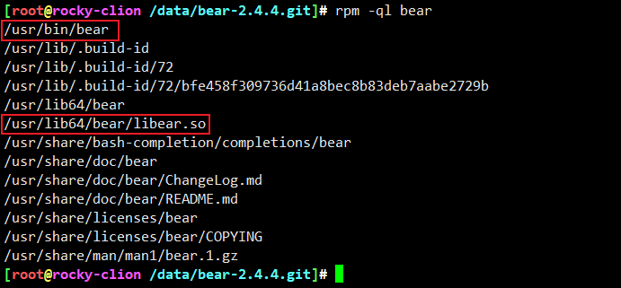
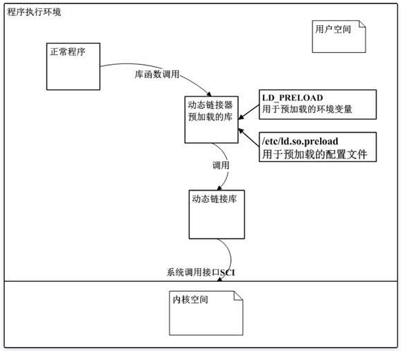
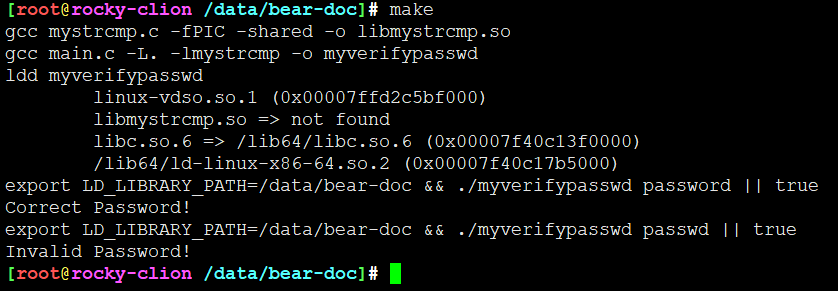
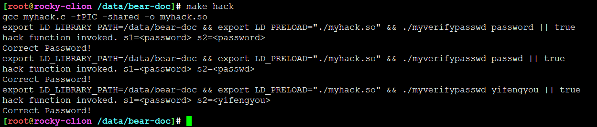
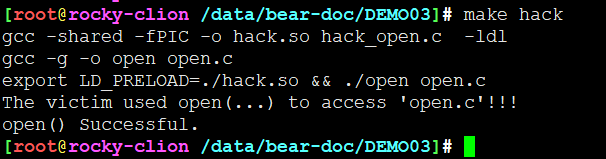
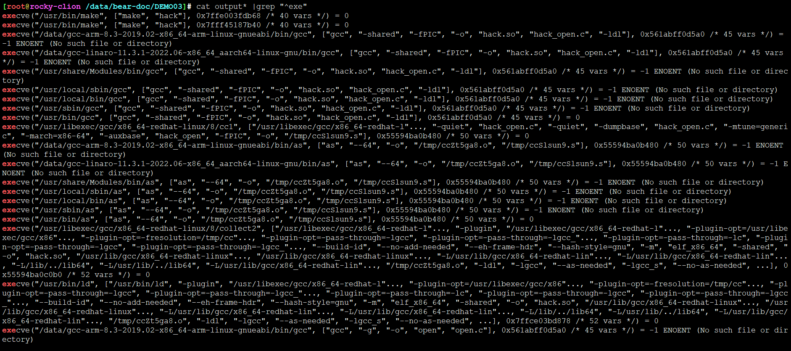

<!-- MDTOC maxdepth:6 firsth1:1 numbering:0 flatten:0 bullets:1 updateOnSave:1 -->

- [参考](#参考)   
- [基本原理](#基本原理)   
   - [动态链接库预加载](#动态链接库预加载)   
   - [DEMO01](#demo01)   
   - [DEMO02](#demo02)   
   - [DEMO3](#demo3)   
   - [strace 获取命令](#strace-获取命令)   
   - [execve获取](#execve获取)   

<!-- /MDTOC -->
# 参考

* <https://blog.csdn.net/chen_jianjian/article/details/80627693>
* <https://www.52coder.net/post/ld-preload>


# 基本原理


```
This module is responsible to capture the compiler invocation of any
build process. The result of that should be a compilation database.

This implementation is using the LD_PRELOAD or DYLD_INSERT_LIBRARIES
mechanisms provided by the dynamic linker. The related library is implemented
in C language and can be found under 'libear' directory.

The 'libear' library is capturing all child process creation and logging the
relevant information about it into separate files in a specified directory.
The input of the library is therefore the output directory which is passed
as an environment variable.

This module implements the build command execution with the 'libear' library
and the post-processing of the output files, which will condensates into a
(might be empty) compilation database.
```

* 官方文档给出了解释





## 动态链接库预加载

* LD_PRELOAD是Linux系统的一个环境变量，它可以影响程序的运行时的链接（Runtime linker），它允许你定义在程序运行前优先加载的动态链接库。这个功能主要就是用来有选择性的载入不同动态链接库中的相同函数。通过这个环境变量，我们可以在主程序和其动态链接库的中间加载别的动态链接库，甚至覆盖正常的函数库。一方面，我们可以以此功能来使用自己的或是更好的函数（无需别人的源码），而另一方面，我们也可以以向别人的程序注入程序，从而达到特定的目的。
* 动态链接库预加载机制是系统提供给用户运行自定义动态链接库的一种方式，在可执行程序运行之前就会预先加载用户定义的动态链接库的一种技术，这种技术可以重写系统的库函数，只需要在预加载的链接库中重新定义相同名称的库函数，程序调用库函数时，重新定义的函数即会短路正常的库函数，这种技术可以用来重写系统中有漏洞的库函数，达到修复漏洞的目的，如get_host_byname导致ghost漏洞的这类函数。
* 这种技术也可以被不怀好意的攻击者用来写rootkit,通过重写mkdir, mkdirat, chdir, fchdir,opendir, opendir64, fdopendir, readdir, readdir64等和系统文件，网络，进程相关的库函数来达到隐藏文件，进程的目的。相对于普通的用户空间rootkit而言，手段更加隐蔽，更加难以被发现，相对于内核模块rootkit来说，兼容性更好，编写难度更低，综合这两种优点，使得这类型rootkit逐年增多，难以查杀。



* LD_PRELOAD，是个环境变量，用于动态库的加载，动态库加载的优先级最高，一般情况下，其加载顺序为

```
LD_PRELOAD > LD_LIBRARY_PATH > /etc/ld.so.cache > /lib>/usr/lib
```

程序中我们经常要调用一些外部库的函数，以rand为例，如果我们有个自定义的rand函数，把它编译成动态库后，通过LD_PRELOAD加载，当程序中调用rand函数时，调用的其实是我们自定义的函数


## DEMO01

```
#include <stdio.h>
#include <string.h>
#include "mystrcmp.h"

void main(int argc,char **argv) {
    char passwd[] = "password";
    if (argc < 2) {
        printf("usage: %s <password>\n",argv[0]);
        return;
    }
    if (!mystrcmp(passwd,argv[1])) {
        printf("Correct Password!\n");
        return;
    }
    printf("Invalid Password!\n");
}
```

```
#include <stdio.h>
int mystrcmp(const char *s1, const char *s2);
```

``` mystrcmp.c
#include <stdio.h>
#include <string.h>
#include "mystrcmp.h"

int mystrcmp(const char *s1, const char *s2)
{
    return strcmp(s1,s2);           //正常字串比较
}
```

```
gcc mystrcmp.c -fPIC -shared -o libmystrcmp.so      #编译动态链接库
gcc myverifypasswd.c -L. -lmystrcmp -o myverifypasswd      #编译主程序
export LD_LIBRARY_PATH=`pwd`      #指定动态链接库所在目录位置
ldd myverifypasswd      #显示、确认依赖关系
./myverifypasswd      #运行主程序myverifypasswd
```


```
// myhack.c
#include <stdio.h>
#include <string.h>

int mystrcmp(const char *s1, const char *s2)
{
    printf("hack function invoked. s1=<%s> s2=<%s>\n", s1, s2);
    // always return 0, which means s1 equals to s2--总是相等
    return 0;
}
```

```
# gcc myhack.c -fPIC -shared -o myhack.so      #编译替换库
# export LD_PRELOAD="./myhack.so"       #设置LD_PRELOAD环境变量,库中的同名函数在程序运行时优先调用
# ./myverifypasswd    yifengyou   #运行主程序
Correct Password!
```





```
all:
	gcc mystrcmp.c -fPIC -shared -o libmystrcmp.so
	gcc main.c -L. -lmystrcmp -o myverifypasswd
	ldd myverifypasswd
	export LD_LIBRARY_PATH=$(PWD) && ./myverifypasswd password || true
	export LD_LIBRARY_PATH=$(PWD) && ./myverifypasswd passwd || true

hack:
	gcc myhack.c -fPIC -shared -o myhack.so
	export LD_LIBRARY_PATH=$(PWD) && export LD_PRELOAD="./myhack.so" && ./myverifypasswd password || true
	export LD_LIBRARY_PATH=$(PWD) && export LD_PRELOAD="./myhack.so" && ./myverifypasswd passwd || true
	export LD_LIBRARY_PATH=$(PWD) && export LD_PRELOAD="./myhack.so" && ./myverifypasswd yifengyou || true

clean:
	rm -rf *.so
	rm -rf myverifypasswd
```


效果：

优先加载了LD_PRELOAD中的mystrcmp函数


## DEMO02

```
#include <stdio.h>
#include <stdlib.h>
#include <time.h>

int main(){
	srand(time(NULL));
	int i = 10;
	while(i--) printf("%d\n",rand()%100);
	return 0;
}
```

```
int rand(){
	return 42; //the most random number in the universe
}
```


```
all:
	gcc -o random random.c
	./random
	ldd random

hack:
	gcc -shared -fPIC hack.c -o hack.so
	LD_PRELOAD=./hack.so ./random
	LD_PRELOAD=./hack.so ldd random
```

## DEMO3

如何调用回原始的函数？


RTLD_NEXT的man手册解释如下:

```
There are two special pseudo-handles, RTLD_DEFAULT and RTLD_NEXT. The former will find the first occurrence of the desired symbol using the default library search order. The latter will find the next occurrence of a function in the search order after the current library. This allows one to provide a wrapper around a function in another shared library.
man手册的解释非常清晰，RTLD_DEFAULT是在当前库中查找函数，而RTLD_NEXT则是在当前库之后查找第一次出现的函数。
```

```
#include <stdio.h>
#include <sys/types.h>
#include <sys/stat.h>
#include <fcntl.h>
#include <string.h>
#include <errno.h>
#include <unistd.h>

int main(int argc, char *argv[])
{
	int fd;

	if(2 != argc)
	{
		printf("Usage :  \n");
		return 1;
	}

	errno = 0;
	fd = open(argv[1],O_RDONLY|O_CREAT,S_IRWXU);

	if(-1 == fd)
	{
		printf("open() failed with error [%s]\n",strerror(errno));
		return 1;
	}
	else
	{
		printf("open() Successful.\n");
	}

	return 0;
}
```

```
#define _GNU_SOURCE
#include <dlfcn.h>
#include <stdio.h>

typedef int (*orig_open_f_type)(const char *pathname, int flags);

int open(const char *pathname, int flags, ...)
{
	/* Some evil injected code goes here. */
	printf("The victim used open(...) to access '%s'!!!\n",pathname);
	//remember to include stdio.h!
	orig_open_f_type orig_open;
	orig_open = (orig_open_f_type)dlsym(RTLD_NEXT,"open");
	return orig_open(pathname,flags);
}
```




```
if(!orign_kill){
  orign_kill = (KILL)dlsym(RTLD_NEXT, "kill");
}
return orign_kill(pid, sig);
```


## strace 获取命令




## execve获取


```
#define _GNU_SOURCE
#include <dlfcn.h>
#include <stdio.h>

typedef int (*orig_open_f_type)(const char *pathname, int flags);

int open(const char *pathname, int flags, ...)
{
	/* Some evil injected code goes here. */
	printf("The victim used open(...) to access '%s'!!!\n",pathname);
	//remember to include stdio.h!
	orig_open_f_type orig_open;
	orig_open = (orig_open_f_type)dlsym(RTLD_NEXT,"open");
	return orig_open(pathname,flags);
}
```


---
